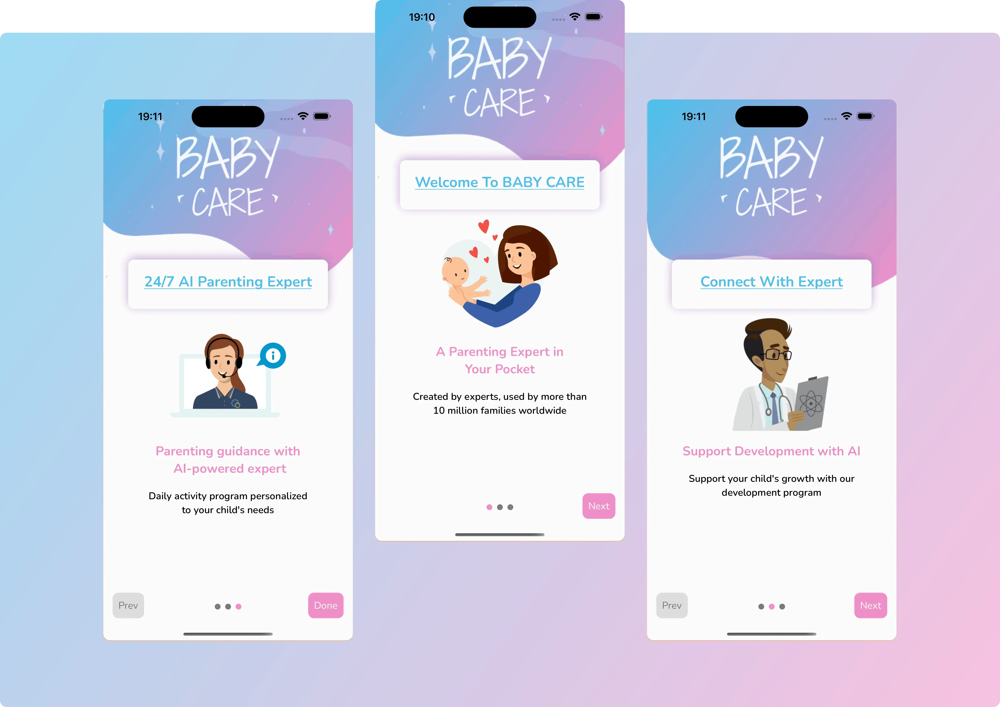

### Purpose

The onboarding process introduces users to the app experience using visually rich slides, followed by a redirection to
onboarding questions after completion.



---

### Features

- **Custom Slide Rendering**: Each slide includes:
    - Top banner image (`bannerImage`)
    - Title (`item.title`)
    - Middle image (`item.image`)
    - Subtitle (`item.text`)
    - Caption (`item.caption`)
- **Navigation Controls**:
    - Next, Prev, and Done buttons with custom styles
    - Dot pagination for slide indicators
- **Transitions**:
    - Upon completion, `is_onboarding_completed` is saved in storage
    - Navigates to the onboarding questions screen using a helper function

---

### File References

- Slide Data Source:
    - Defined in `constants/API_RESPONSES.ts` as `INTRO_SLIDES`
- Components Used:
    - `TopBannerContainer`
    - `ThemedText`
    - `ThemedView`
- Helpers Used:
    - `setStorage` from `helpers/helper.ts`
    - `toOnboardingQuestions` from `helpers/navigation_handler.ts`

---

### Custom Styling

Custom styles are defined for:

- Button appearances (Next, Prev, Done)
- Dot indicators (active and inactive)
- Layout and alignment of slide content

---


### Related Folder Structure

```plaintext
|components
│└── TopBannerContainer.tsx
|constants
├── API_RESPONSES.ts ← contains INTRO_SLIDES
|screens
├── IntroSlider.tsx
```

---